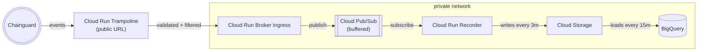

# Cloud Events Recorder

This module sets up infrastructure to listen to Chainguard Image pull events and store them in BigQuery, for later analysis.

You can set up the infrastructure with Terraform. Create a file called `main.tf` with the following content:

```
module "image-copy" {
  source = "github.com/chainguard-dev/platform-examples//event-recorder/iac"

  project_id = "my-gcp-project"
  region     = "us-central1"
  group      = "[MY-CHAINGUARD-GROUP-ID]"
}
```

Then in that directory, run `terraform init` and `terraform apply` to create the infrastructure.

## Architecture



The event recorder infrastructure leverages GCP Cloud Run, Cloud Pub/Sub and Cloud Storage to efficiently buffer events before loading into BigQuery.

This means that records may not be published immediately -- there is a delay of up to 18 minutes end-to-end -- but bursts of requests should be handled gracefully without dropping events.

## Data Schema

The Terraform creates a BigQuery dataset named `cloudevents_pull_event_recorder`, with a table named `dev_chainguard_registry_pull_v1`.

The schema is described [here](./iac/pull.schema.json), and contains fields describing the user who pulled the image, the image that was pulled, the time of the pull, and information about errors that occurred during the pull. This schema matches the type described in the [event documentation](https://edu.chainguard.dev/chainguard/administration/cloudevents/events-reference/#service-registry---pull).

## Destroying the infrastructure

There are GCP costs associated with running the infrastructure to ingest and store events.

To destroy the infrastructure, run `terraform destroy`.
