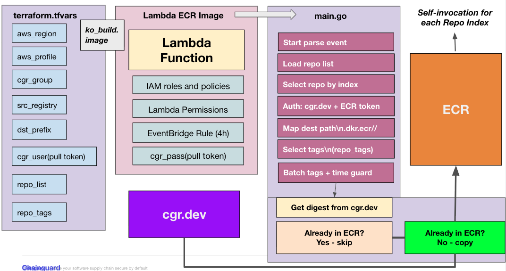

# ECR Lambda Mirror with Terraform

This project provisions a Lambda function with Terraform that mirrors images from **cgr.dev** into **AWS ECR**.

## Overview

* lists all repos + tags in your Chainguard group
* ensures a matching ECR repo exists (same path, optional prefix),
* creates the ECR repository if it does not exist
* Pulls from cgr.dev/<namespace>/<repo>:<tag> and mirrors into ECR.
* Uses your pull token for cgr.dev.
* Auths into ECR via the AWS SDK default credentials chain.
* Pre-checks if the image already exists in ECR (by tag+digest) before copying
* If it exists, it skips and logs skip exists without downloading layers
* schedule.tf runs the lamba function every 4 hours by default
* Each repository copy is invoked in a single lambda function
* repo-tags var allows to specify which tags to mirror (if not all or latest)

## Architecture



### Environment variables the Lambda expects

Set these in your Terraform aws_lambda_function environment {}:

```
      SRC_REGISTRY = var.src_registry
      GROUP_NAME   = var.group_name
      DST_PREFIX   = var.dst_prefix

      # Pull-token credentials for cgr.dev (username=identity id, password=JWT)
      CGR_USERNAME = var.cgr_username
      CGR_PASSWORD = var.cgr_password

      # Optional knobs for your chaining main.go
      REPO_LIST_JSON = jsonencode(var.repo_list)
      COPY_ALL_TAGS  = tostring(var.copy_all_tags)
      REPO_TAGS_JSON = jsonencode(var.repo_tags)

      # Booleans must be strings in Lambda env
      MIRROR_DRY_RUN = tostring(var.mirror_dry_run)
```

### Mirroring & Skips

main.go uses the same underlying library (go-containerregistry), but through its Go APIs:

* remote.List(repoRef, …) → lists tags from cgr.dev
* remote.Get(srcRef, …) → pulls an image/index manifest
* remote.Write(dstRef, img, …) / remote.WriteIndex(dstRef, idx, …) → pushes into ECR

### Destination Repo Settings 

terraform.tfvars
```
aws_region  = "us-east-2"
aws_profile = "cg-dev"

group_name  = "bannon.dev"
name_prefix = "chainguar-image-mirror"

# optional: dst_prefix = "mirrors"

# identity id (username) for your pull token
cgr_username = "b3afeb8ee1de8a24fe87ccb26faee88b5ba3cac0/7d8f1d77937ae3d2"

mirror_dry_run = false

repo_list = [
  "cgr.dev/bannon.dev/datadog-agent",
  "cgr.dev/bannon.dev/node",
  "cgr.dev/bannon.dev/python",
  "cgr.dev/bannon.dev/jdk",
  "cgr.dev/bannon.dev/jre",
  "cgr.dev/bannon.dev/envoy",
]

copy_all_tags = true

repo_tags = {
  "cgr.dev/bannon.dev/node"        = ["22]
  "cgr.dev/bannon.dev/datadog-agent" = ["7.69", "7.69-dev"]
}
```

# Usage

## Go Mod Sanity Check

```
go mod tidy
```
## Create the image-copy-all repository to execute Lambda mirror from

Note: requires pull token password during init. Your pull token username is defined in terraform.tfvars and configured to use this variable. 

```
cd iac/
export AWS_PROFILE=cg-dev
export AWS_REGION=us-east-2

terraform init -upgrade
terraform plan
terraform apply -auto-approve \
  -var='cgr_password=<PULL_TOKEN_PASS>'
```

## Invoke the Lambda Function

```
  aws lambda invoke \
  --function-name image-copy-all \
  --region us-east-2 \
  --log-type Tail \
  --payload '{}' \
  response.json
```

## Follow the logs for progress 

```
aws logs tail /aws/lambda/image-copy-all --region us-east-2 --follow
```
For a specific image (.e Datadog)
```
aws logs tail /aws/lambda/image-copy-all --region us-east-2 --follow | grep datadog-agent
```